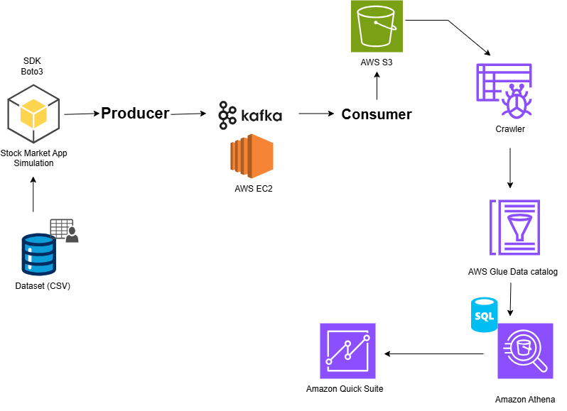

# 📈 Stock Market Real-Time ETL Pipeline using Kafka + AWS

This project simulates a *real-time stock market streaming pipeline* using *Apache Kafka* and AWS services.  
Stock market events are produced continuously, streamed through Kafka, stored in an *Amazon S3 data lake, cataloged using **AWS Glue, queried with **Amazon Athena, and visualized using **Amazon QuickSight*.

---

## 🚀 Project Objective
To build an end-to-end *big data streaming pipeline* that demonstrates real-time ingestion, storage, cataloging, querying, and dashboarding.

---

## 🏗️ Architecture
Producer → Kafka (EC2) → Consumer → S3 → Glue Crawler → Athena → QuickSight Dashboard

📌 Architecture Diagram:  


---

## 🛠️ Tech Stack
- *Python*
- *Apache Kafka*
- *AWS EC2*
- *Amazon S3*
- *AWS Glue (Crawler + Data Catalog)*
- *Amazon Athena*
- *Amazon QuickSight*

---

## 📂 Repository Structure

```bash
.
├── producer/
│   ├── kafka_producer_realtime.py
│   ├── requirements.txt
│   ├── config.example.env
│   └── README.md
│
├── consumer/
│   ├── kafka_consumer_to_s3.py
│   ├── requirements.txt
│   ├── config.example.env
│   └── README.md
│
├── glue/
│   ├── README.md
│   ├── crawler_config.md
│   ├── table_schema.md
│   ├── permissions.md
│   └── athena_queries.sql
│
└── architecture/
    ├── architecture.png
    └── dashboard_preview.png
